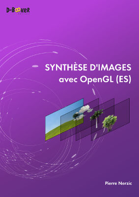

## Synthèse d'images avec OpenGL(ES)
Ce dépôt contient les codes sources des exemples du livre [Synthèse d'images d'OpenGL(ES)](https://www.d-booker.fr/opengl/78-synthese-d-images.html). Les exemples sont disponibles en C++ et en WebGL2, et certains pour Android.

Ce livre est écrit par Pierre Nerzic
et il est publié par les éditions [D-BookeR](http://www.d-booker.fr).

Si ces exemples vous intéressent et que vous n'avez pas acheté le livre, nous vous invitons à le [faire](https://www.d-booker.fr/opengl/78-synthese-d-images.html). Sa rédaction est le fruit d'un gros travail et votre soutien nous sera précieux.

À noter que ces exemples ne pourront fonctionner que sur un PC équipé d'une carte graphique assez récente. Pour vérifier si votre navigateur est capable de faire fonctionner la version WebGL2, vous pouvez l'évaluer avec la page [WebGL2 Report](http://webglreport.com/?v=2).
